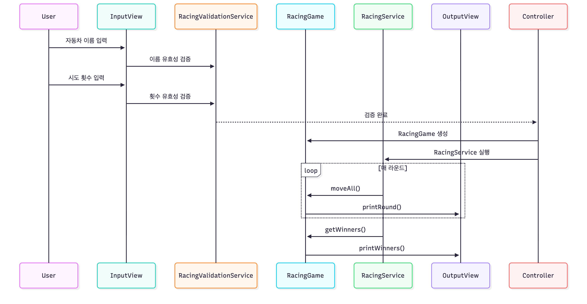
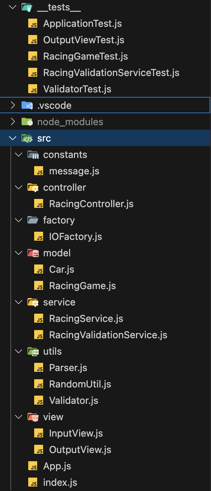
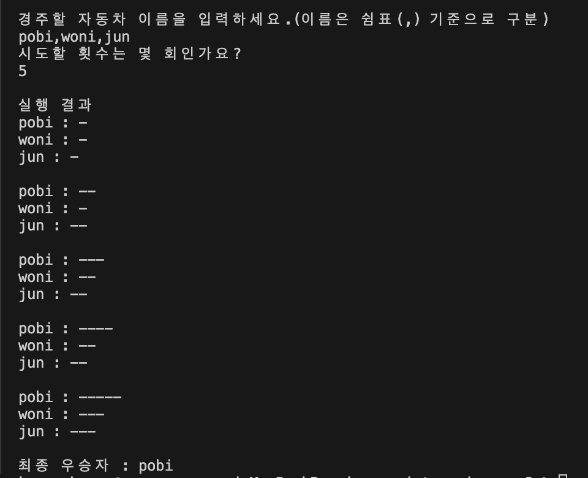
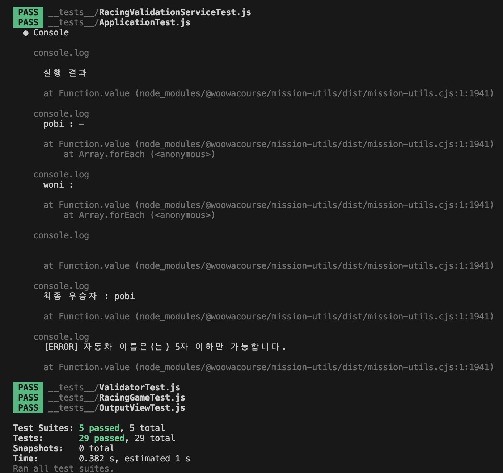

# javascript-racingcar-precourse

사용자가 입력한 자동차들이 주어진 횟수만큼 경주를 진행하며, 랜덤 조건에 따라 전진하거나 멈춥니다.
 경주가 끝난 후 최종 우승자를 출력하는 콘솔 기반 프로젝트입니다.
 
과제 요구사항을 참고하여 기능 목록 단위 커밋을 위해 기능 체크리스트를 우선적으로 작성합니다.

## 요구사항 요약

- 자동차 이름 입력
  - 쉼표(,)로 구분된 자동차 이름을 입력받는다
  - 이름은 최대 5자
- 이동 횟수 입력
  - 시도할 횟수를 정수로 입력받는다.
- 전진 조건
  - 0 ~ 9 사이 랜덤 숫자가 4 이상일 경우 전진
- 출력
  - 각 라운드마다 자동차 이름과 이동거리 (-) 출력
  - 최종 우승자(1명 이상)를 ,로 구분해 출력
- 잘못된 입력
  - [ERROR] 메시지 출력 후 에러 throw
- 테스트코드 작성

## 기능 체크리스트

> README에 기록된 목록 단위로 커밋하기 위한 체크리스트입니다.

### 설계 기반 기능 나열

이번 프로젝트는 MVC 아키텍처를 기반으로 설계하였습니다. 도메인 로직(Model), 입출력(View), 흐름 제어 (Controller)를 명확히 분리하여 유지 보수성과 확장성을 높이는 것을 목표로 했습니다.
 

특히 저번주차에 부족했던 에러처리에 대해 체크리스트를 작성하고 보다 완성도 있는 결과물을 목표로 했습니다.

- Model (자동차와 게임의 핵심 비즈니스 로직 관리)
  - 자동차 이름과 현재 위치 저장, 전진 조건을 만족하면 이동
  - 자동차 목록 관리, 전체 이동 및 우승자 판별 수행

 

- Controller (입력 흐름 및 제어 담당)
  - 사용자 입력을 받아 검증
  - 전체 실행 흐름 관리, 예외 발생 시 [ERROR] 출력

 

- View (사용자 입력 및 출력)
  - 사용자 입력을 받아옴
  - 게임 실행 과정, 결과, 우승자 출력
  - 각종 에러 메시지 출력
  - 객체 생성 관리 팩토리 포함

 

- Service (라운드 별 실행 및 출력 타이밍 제어)
  - 게임의 라운드 순차적 실행 및 각 라운드 결과 출력 관리
  - 라운드 별 1초 간격 출력 기능
  - 최종 우승자 계산

 

- Utils (랜덤 난수, 입력 검증, 딜레이 등 공통 유틸 함수)
  - 0~9 사이 랜덤 값 생성, 4 이상 여부 판별
  - 자동차 이름 및 시도 횟수 입력값 검증
  - Promise 기반 비동기 지연 제공

 

- Constants (각 종 메시지 상수 처리)
  - 입력/출력/에러 메시지 상수로 관리

### 에러 체크리스트

- 자동차 이름 입력

  - [ ] 5자 초과 입력 시
  - [ ] 같은 이름 2회 이상 입력 시
  - [ ] 입력 값이 비어있을 때
  - [ ] 쉼표로만 입력되었을 때 ex)pobi,,jun
  - [ ] 이름에 공백 포함되었을 때

- 시도 횟수 관련

  - [ ] 입력이 비어있을 때
  - [ ] 숫자가 아닐 때
  - [ ] 0 이하의 수를 입력했을 때
  - [ ] 소수를 입력했을 때

## 구현 내용

### 아키텍처 구조

> 전반적인 프로젝트 구조와 각 클래스의 역할에 대해 간단히 정리한 섹션입니다.

 
2주차 프로젝트는 MVC 패턴 기반의 아키텍처를 선택하여 설계했습니다.
 
입력 -> 검증 -> 로직 처리 -> 출력 까지의 일련의 흐름을 명확히 분리하여 
유지보수성과 책임 분리를 명확히 하기 위한 설계를 했습니다.
 
 

#### 서비스 흐름 및 폴더 구조

|            서비스 흐름 다이어그램            |
| :------------------------------------------: |
|  |
|   서비스 흐름을 나타내는 다이어그램입니다.   |

 

|                      프로젝트 폴더 구조                      |
| :----------------------------------------------------------: |
|                       |
| 프로젝트 주요 클래스 및 역할을 나타내는 디렉터리 구조입니다. |

 

### 구조 별 설명

1️⃣ controller

- RacingController.js
  - 전체 프로그램의 진입점이자 흐름을 제어하는 컨트롤러

 

2️⃣ model

- Car.js

  - 각 자동차 객체를 표현하는 도메인 모델

- RacingGame.js
  - 전체 자동차 리스트를 담당하고, 경주 로직을 담당하는 핵심 도메인

 

3️⃣ service

- RacingService.js

  - RacingGame(Model)과 OutputView(View)를 연결하는 중간 제어 레이어.

- RacingValidationService.js
  - 입력값의 유효성을 검증하는 비즈니스 검증 레이어

 

4️⃣ view

- InputView.js

  - 사용자 입력 담당
  - 콘솔에서 자동차 이름 및 시도 횟수 입력받음

- OutputView.js
  - 콘솔 출력 담당
  - 결과를 시각적으로 보여줌

 

5️⃣ factory

- IOFactory.js
  - InputView / OutputView 인스턴스를 생성하는 팩토리 클래스
  - 외부에서 직접 new 하지 않고, IOFactory를 통해 입출력 객체를 일관적으로 관리

 

6️⃣ utils

- RandomUtils.js

  - 자동차의 이동 여부 결정을 위한 랜덤 숫자 생성 유틸리티

- Validator.js

  - 입력값을 검증하는 유틸리티

- Parser.js

  - 문자열을 필요에 따라 파싱하는 유틸리티

 

7️⃣ tests

- 기능 단위 테스트를 위한 테스트 코드

 

## 예외처리

1주차 코드리뷰를 하며 요구사항에 명시되어 있는 예외사항을 제하더라도 신경쓸 예외 처리가 많다는 것을 깨달았습니다.
 
이번 2주차에서는 최대한 발생할 수 있는 예외 사항을 신경쓰며 개발을 진행했습니다.

- 자동차 이름 중복 입력 시

  - [ERROR] 자동차 이름이 중복되었습니다.

- 자동차 이름 입력할 때 쉼표만 입력했을 시

  - [ERROR] 자동차 이름은 비어있을 수 없습니다.

- 아무 값도 입력하지 않았을 시

  - 자동차 이름: [ERROR] 자동차 이름을 1개 이상 입력해야 합니다.
  - 시도 횟수: [ERROR] 시도 횟수를 입력해야 합니다.

- 자동차 이름 6자 이상 입력 시

  - [ERROR] 자동차 이름은(는) 5자 이하만 가능합니다.

- 시도횟수 0 이하의 숫자 혹은 문자 입력 시

  - [ERROR] 시도 횟수는 1 이상의 숫자여야 합니다.

- 시도횟수 소수 입력 시
  - [ERROR] 시도 횟수는 정수여야 합니다.

 

## 실행 화면 및 테스트 화면

|              실행 화면 캡쳐              |
| :--------------------------------------: |
|              |
| 시도 횟수 5를 입력했을 때 실행화면입니다 |

|       테스트 화면 캡쳐        |
| :---------------------------: |
|  |
